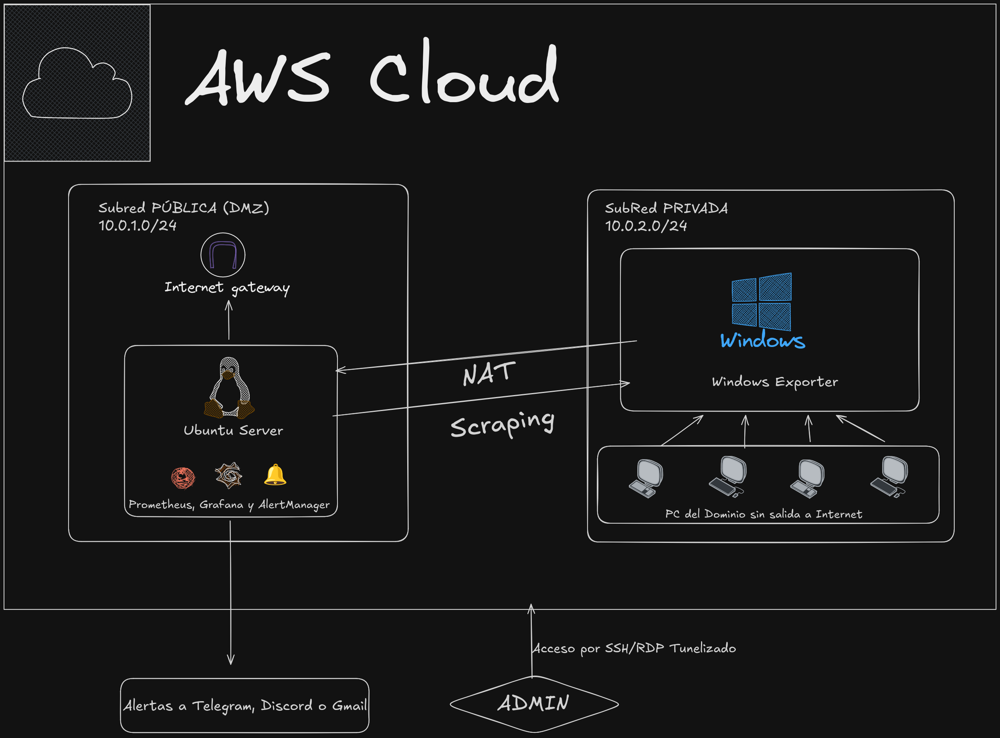

## 3. Diseño de la solución

En esta fase se define la arquitectura técnica detallada que dará soporte a los requisitos planteados, estableciendo la topología de red, la selección de tecnologías y las políticas de seguridad.

### 3.1. Arquitectura de Red y Topología (AWS VPC)
La infraestructura se desplegará sobre una única **VPC (Virtual Private Cloud)** en AWS, segmentada para garantizar el aislamiento del servidor de dominio.

* **Espacio de Direcciones (CIDR):** `10.0.0.0/16`
* **Subred Pública (DMZ):**
    * **CIDR:** `10.0.1.0/24`
    * **Recurso:** Servidor Ubuntu (Gateway).
    * **Enrutamiento:** Conectada a un Internet Gateway (IGW) para tráfico directo de entrada/salida.
* **Subred Privada (Intranet):**
    * **CIDR:** `10.0.2.0/24`
    * **Recurso:** Windows Server 2022 (Controlador de Dominio).
    * **Enrutamiento:** Sin acceso directo a Internet. Su tabla de rutas apuntará a la interfaz de red (ENI) de la instancia Ubuntu para todo el tráfico `0.0.0.0/0` (NAT).

### 3.2. Selección de Tecnologías y Componentes
Se han seleccionado las siguientes tecnologías para cubrir los requisitos funcionales:

* **Servidor de Borde (Gateway):**
    * **SO:** Ubuntu Server 22.04 LTS.
    * **NAT:** Configuración mediante `iptables` (IP Masquerade) y *IP Forwarding* a nivel de kernel.
    * **Monitorización:** Prometheus (TSDB), Alertmanager (gestión de alertas) y Grafana (visualización).
* **Servidor Interno:**
    * **SO:** Windows Server 2022 Base.
    * **Roles:** Active Directory Domain Services (AD DS) y DNS.
* **Agentes de Métricas:**
    * *Node Exporter* (para métricas de Linux).
    * *Windows Exporter* (para métricas de Windows Server).

### 3.3. Diseño de Seguridad y Accesos
La seguridad se implementará en dos capas: **Security Groups** (firewall de red de AWS) y configuración del sistema operativo.

#### A. Estrategia de Security Groups (AWS)
Definición de reglas de tráfico permitidas:

**1. SG-Gateway (Instancia Ubuntu):**
* **Inbound (Entrada):**
    * `TCP/22` (SSH): Permitido desde `0.0.0.0/0` (Recomendado restringir a IP de administración).
    * `TCP/3389` (RDP Forwarded): Permitido para redirigir tráfico al Windows Server.
    * `TCP/3000` (Grafana): Acceso al dashboard de monitorización.
    * `Tráfico Interno`: Todo el tráfico procedente de la subred privada (`10.0.2.0/24`) para permitir la salida a Internet (NAT).
* **Outbound (Salida):** Todo permitido.

**2. SG-Internal (Windows Server):**
* **Inbound (Entrada):**
    * `TCP/3389` (RDP): Permitido **exclusivamente** desde el Grupo de Seguridad del Gateway (SG-Gateway).
    * `TCP/UDP 53, 88, 135, 389, 445, 464, 636` (Active Directory): Tráfico interno permitido desde la subred pública.
    * `TCP/9182` (Métricas): Puerto del *Windows Exporter* permitido solo desde la IP privada del Gateway (Prometheus).
* **Outbound (Salida):** Todo permitido (el tráfico saldrá efectivamente a través del Gateway).

#### B. Acceso Remoto y Port Forwarding
Dado que el Windows Server se encuentra en una red privada aislada, se implementará una regla de **DNAT (Destination NAT)** en el servidor Ubuntu.
* El administrador conectará por RDP a la IP Pública del Ubuntu (`IP_Ubuntu:3389`).
* `iptables` redirigirá esa petición a la IP Privada del Windows (`IP_Windows:3389`), garantizando la administración sin exponer el servidor interno directamente.

### 3.4. Diseño del Sistema de Monitorización y Alertas
El flujo de datos para la observabilidad seguirá el siguiente esquema:

1.  **Recolección:** *Prometheus* (en Ubuntu) realizará peticiones periódicas (*scraping*) al `localhost:9100` (Node Exporter) y a la `IP_Privada_Windows:9182` (Windows Exporter).
2.  **Visualización:** *Grafana* leerá la base de datos de Prometheus para pintar los paneles de control.
3.  **Alertado:**
    * Se definirán reglas en Prometheus.
    * Cuando se active una regla, Prometheus enviará la señal a *Alertmanager*.
    * *Alertmanager* gestionará la notificación y la enviará al canal configurado (Webhook de Discord o Bot de Telegram).

### 3.5. Documentos generados
* Documento de Diseño de la Solución (Diagramas de red y esquemas de direccionamiento).
* Especificación de reglas de Firewall y Security Groups.

### 3.6. Esquema de la Solución
A continuación se presenta el diagrama topológico de la infraestructura...

*Figura 1: Topología de red en AWS con segmentación de subredes.*
