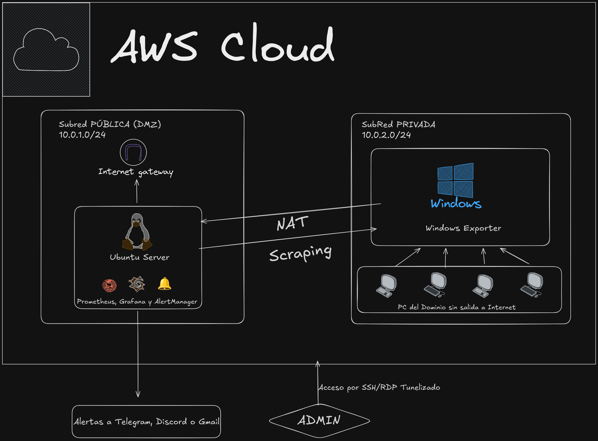
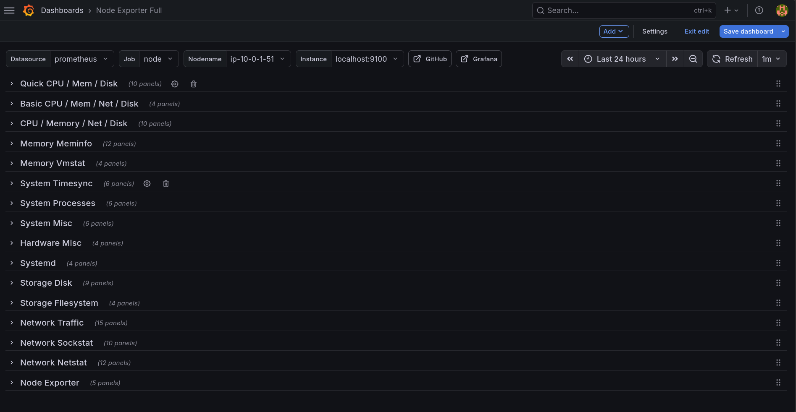
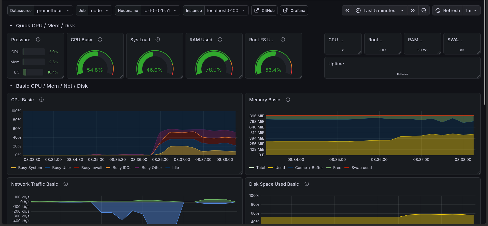
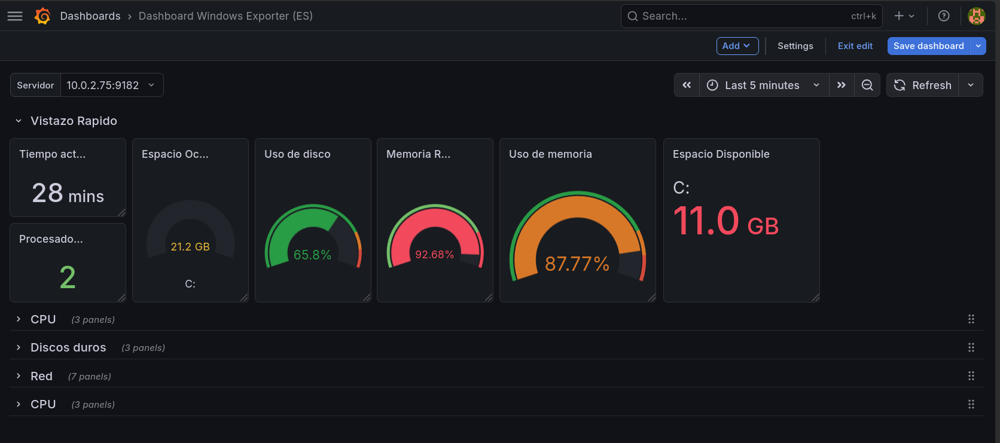
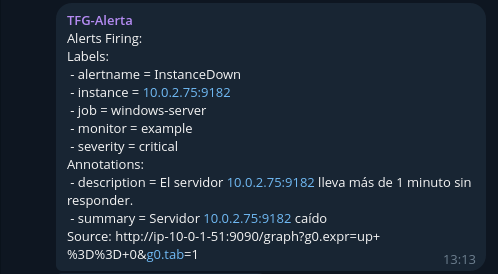
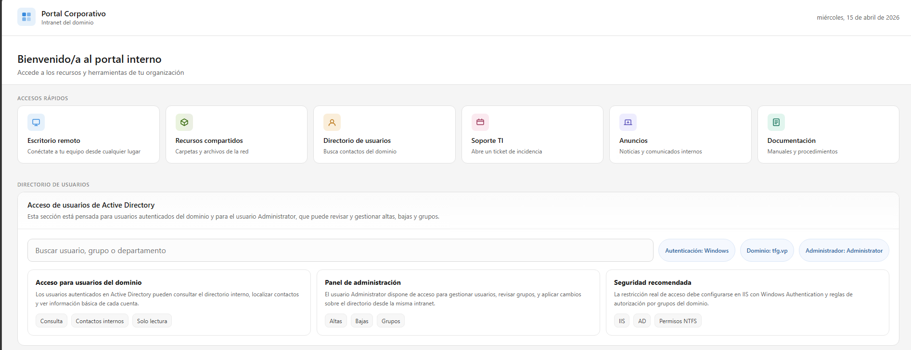
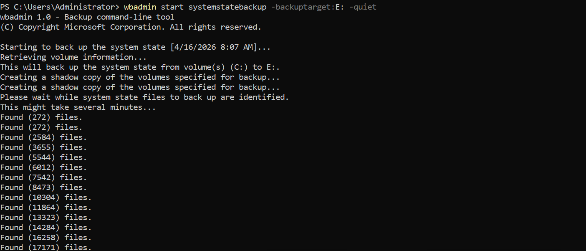
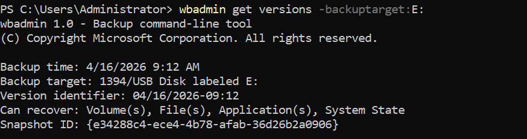
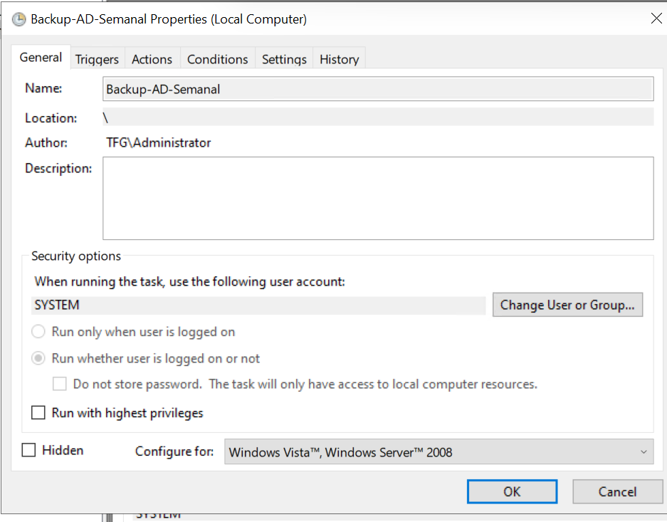

# TFG: Despliegue de Infraestructura de Red Segura Híbrida en AWS con Monitorización Centralizada

**Autores:** "Víctor Alberjón Hidalgo y Pablo Arias Montilla" 

---

## 1. Planificación inicial

En esta fase se establecen las bases del proyecto, definiendo el alcance, los recursos necesarios y las restricciones que guiarán el desarrollo.

### 1.1. Objetivo

El objetivo principal es diseñar e implantar una infraestructura de red segura en la nube pública (AWS), utilizando una arquitectura de Gateway Linux (Ubuntu) para proteger y enrutar el tráfico de una subred privada donde reside un servidor Windows. Adicionalmente, se busca implementar un sistema de observabilidad que centralice la monitorización de tráfico y recursos de ambos servidores, integrando mecanismos de alerta temprana ante fallos críticos, todo ello bajo un paradigma de **automatización y GitOps**.

### 1.2. Alcance del proyecto

El proyecto contempla la ejecución de las siguientes tareas clave:

* **Infraestructura como Código (IaC):** Automatización total del despliegue mediante AWS CloudFormation (GitOps).
* **Despliegue de Red (VPC):** Configuración de una nube privada virtual segmentada en subredes pública (DMZ) y privada (Intranet).
* **Servidor de Borde (Ubuntu Server):** Configuración como NAT Instance, seguridad perimetral (iptables) y despliegue de stack de monitorización (Prometheus + Grafana).
* **Servidor Interno (Windows Server):** Aislamiento de red (sin IP pública directa) y configuración de servicios internos (Active Directory).
* **Active Directory:** Despliegue de dominio Windows para gestión centralizada de identidades.
* **VPN (WireGuard):** Configuración de túnel VPN para acceso remoto seguro de usuarios al dominio.
* **Gestión y Acceso:** Acceso remoto seguro mediante SSH y RDP (vía Port Forwarding en el Gateway).
* **Interconexión y Visibilidad:** Configuración de tablas de rutas para forzar el tráfico a través del Gateway.

### 1.3. Recursos identificados

* **Infraestructura (AWS EC2 & CloudFormation):**
    * 1x Instancia **t3.micro** (Ubuntu Server 22.04 LTS) + **IP Elástica**.
    * 1x Instancia **t3.small** (Windows Server 2022). *Nota: Se aumentó de micro a small para garantizar la estabilidad del sistema.*
* **Software y Servicios:**
    * Red y Automatización: IPTables, VPC Routing, YAML (CloudFormation).
    * Monitorización: Prometheus, Grafana, Alertmanager, Node Exporter, Windows Exporter.
    * VPN: WireGuard para acceso remoto seguro.

### 1.4. Restricciones y condicionantes

* **Económicas:** Viabilidad dentro de la capa gratuita (Free Tier) de AWS siempre que sea posible.
* **Seguridad:** Administración a través de puertos estándar (22 y 3389) protegidos por Security Groups.
* **Plazos:** Despliegue funcional antes de la fecha de defensa del TFG.

### 1.5. Cronograma preliminar

| Fase | Tarea Principal | Semanas | Descripción |
| :--- | :--- | :--- | :--- |
| Fase 1 | Planificación | 1 - 2 | Definición de alcance y estudio de viabilidad. |
| Fase 2 | Diseño | 3 - 4 | Diagramas de red VPC y políticas de seguridad. |
| Fase 3 | Despliegue Infra | 5 - 6 | Creación de VPC, subredes y automatización IaC. |
| Fase 4 | Configuración | 7 - 8 | Configuración de NAT, Firewall y Monitorización. |
| Fase 5 | Accesos | 9 | Habilitación de SSH y RDP mediante Port Forwarding. |
| Fase 6 | Validación | 10 | Pruebas de conectividad y estrés. |
| Fase 7 | Documentación | 11 - 12 | Redacción final de la memoria y defensa. |

---

## 2. Análisis de requisitos

### 2.1. Requisitos Funcionales (RF)

* **RF-01 (Enrutamiento NAT):** El servidor Ubuntu debe actuar como puerta de enlace para la subred privada.
* **RF-02 (Despliegue Automatizado):** La infraestructura debe poder recrearse de forma idéntica sin intervención manual.
* **RF-03 (Seguridad de Red):** Gestión del tráfico mediante firewall permitiendo solo administración autorizada.
* **RF-04 (Monitorización de Tráfico):** Captura de métricas de ancho de banda en la interfaz del Gateway.
* **RF-05 (Dashboard Unificado):** Grafana debe mostrar el estado de recursos de ambos servidores.
* **RF-06 (Active Directory):** Implementar dominio Windows con AD para gestión centralizada de usuarios y recursos.
* **RF-07 (Acceso VPN):** Configurar WireGuard para permitir acceso remoto seguro de usuarios al dominio corporativo.
* **RF-08 (Gestión de Alertas):** Notificaciones en tiempo real (Telegram) ante anomalías críticas.
* **RF-09 (Acceso Remoto):** Garantizar acceso administrativo vía SSH (22) y RDP (3389).

### 2.2. Requisitos No Funcionales (RNF)

* **RNF-01 (Aislamiento):** La instancia Windows debe residir en una subred privada sin IP pública directa.
* **RNF-02 (Inmutabilidad):** Aplicación de principios GitOps para garantizar la consistencia del entorno.
* **RNF-03 (Disponibilidad):** Los servicios de enrutamiento deben iniciarse automáticamente (systemd).
* **RNF-04 (Seguridad VPN):** Las conexiones VPN deben utilizar cifrado fuerte. WireGuard emplea criptografía moderna (ChaCha20, Curve25519).
* **RNF-05 (Rendimiento):** El Gateway debe mantener latencias de enrutamiento aceptables sin afectar significativamente el rendimiento de la red.
* **RNF-06 (Documentación):** Toda configuración debe estar documentada y versionada para garantizar replicabilidad del entorno.

### 2.3. Usuarios finales y sus necesidades

El sistema está diseñado para ser utilizado por diferentes perfiles de usuario, cada uno con necesidades específicas:

| Perfil | Descripción | Necesidades |
|--------|-------------|-------------|
| **Administrador de sistemas** | Responsable de la gestión y mantenimiento de la infraestructura | Acceso SSH al Gateway, acceso RDP al Windows Server, visualización de dashboards de monitorización, recepción de alertas |
| **Administrador de dominio** | Gestiona el Active Directory y los usuarios del dominio | Acceso RDP al Windows Server, acceso al dominio tfg.vp |
| **Usuario corporativo** | Usuario final que accede a recursos del dominio | Conexión VPN para acceso remoto, acceso al dominio corporativo |
| **Operador de monitorización** | Supervisa el estado de la infraestructura | Acceso a Grafana, recepción de alertas en Telegram |

#### Matriz de acceso por perfil

| Recurso | Admin Sistemas | Admin Dominio | Usuario Corp. | Operador |
|---------|---------------|---------------|---------------|----------|
| SSH Gateway | ✓ | - | - | ✓ |
| RDP Windows | ✓ | ✓ | - | - |
| VPN | ✓ | ✓ | ✓ | - |
| Grafana | ✓ | - | - | ✓ |
| Dominio AD | ✓ | ✓ | ✓ | - |
| Alertas | ✓ | - | - | ✓ |

---

## 3. Diseño de la solución

### 3.1. Arquitectura de Red y Topología (AWS VPC)

* **VPC CIDR:** `10.0.0.0/16`
* **Subred Pública (DMZ):** `10.0.1.0/24`. Aloja el Gateway Ubuntu con IP Elástica.
* **Subred Privada (Intranet):** `10.0.2.0/24`. Aloja el Windows Server. Su tráfico `0.0.0.0/0` apunta a la interfaz de red del Ubuntu.
* **Subred VPN (WireGuard):** `172.16.3.0/24`. Fuera del CIDR de la VPC para evitar conflictos con las tablas de rutas de AWS.

### 3.2. Diseño de Seguridad y Accesos

1. **SG-Gateway (Ubuntu):** Inbound: 22/TCP (SSH), 3389/TCP (RDP Forward), 3000/TCP (Grafana), 9090/TCP desde VPC (Prometheus), 9093/TCP desde VPC (Alertmanager), 51820/UDP (WireGuard), todo el tráfico desde `10.0.2.0/24` y `172.16.3.0/24`. Outbound: Todo permitido.
2. **SG-Internal (Windows):** Inbound: todo el tráfico desde `172.16.3.0/24` (VPN), 3389/TCP (RDP) desde SG-Gateway, 9182/TCP (Windows Exporter) desde SG-Gateway, 53/TCP-UDP (DNS) desde SG-Gateway, ICMP desde SG-Gateway. Outbound: Todo permitido.

### 3.3 Esquema de la arquitectura

*Figura 1: Topología de red en AWS con segmentación de subredes.*

### 3.4. Análisis de puntos únicos de fallo (SPOF)

Un **punto único de fallo** (Single Point of Failure, SPOF) es un componente del sistema cuya caída provoca la interrupción total del servicio que presta. En la arquitectura desplegada, la restricción de recursos a dos instancias (Gateway Ubuntu + Windows Server) genera inherentemente varios SPOF que deben ser identificados y mitigados en la medida de lo posible.

#### Identificación de puntos únicos de fallo

| Componente | Rol en la arquitectura | SPOF | Impacto si falla |
|------------|----------------------|------|-------------------|
| Gateway Ubuntu | NAT, VPN, Port Forwarding, stack de monitorización | Sí | Subred privada sin salida a Internet, VPN caída, sin dashboards ni alertas |
| Windows Server (DC) | Controlador de dominio único, DNS integrado, GPOs | Sí | Sin autenticación, sin resolución DNS, políticas no aplicadas |
| Stack de monitorización | Prometheus + Grafana + Alertmanager (en el Gateway) | Sí | Pérdida total de visibilidad del estado de la infraestructura y de notificaciones |

#### Análisis por componente

##### Gateway Ubuntu

El Gateway concentra múltiples funciones críticas: actúa como puerta de enlace NAT para la subred privada (sección 4.2), servidor VPN WireGuard (sección 4.7), punto de Port Forwarding para RDP y aloja la totalidad del stack de monitorización (secciones 4.9–4.11). Su caída supondría la pérdida de conectividad de la subred privada con Internet, la interrupción del acceso VPN remoto y la desaparición de toda capacidad de observabilidad.

**Mitigaciones adoptadas:**

- **Auto-provisionamiento vía CloudFormation:** El UserData del template (`despliegue-tfg.yml`) permite recrear la instancia con toda su configuración base sin intervención manual.
- **Detección temprana:** La regla de alerta `InstanceDown` (sección 4.9) detecta la caída del Gateway en un plazo de 1 minuto, notificando vía Telegram.
- **Persistencia de configuración:** Las reglas de iptables se persisten mediante `iptables-persistent`, y el script `bootstrap.sh` (sección 4.16) automatiza la reconstrucción completa del servidor.
- **Datos de monitorización en disco local:** Prometheus almacena las métricas en disco, por lo que un reinicio del Gateway no implica pérdida de datos históricos.

**En un entorno productivo:** Se desplegaría un segundo Gateway en alta disponibilidad (VRRP/keepalived o NAT Gateway gestionado de AWS) y se realizarían snapshots periódicos de AMI para recuperación rápida.

##### Windows Server (Controlador de dominio)

El Windows Server opera como controlador de dominio único para `tfg.vp`, incluyendo el servicio DNS integrado. Al no existir una réplica del DC, su caída implica la imposibilidad de autenticar usuarios, resolver nombres del dominio y aplicar políticas de grupo (GPOs).

**Mitigaciones adoptadas:**

- **Detección temprana:** Las reglas `InstanceDown`, `HighCPUWindows` y `HighMemoryWindows` (sección 4.9) proporcionan visibilidad sobre el estado del servidor Windows antes de que un fallo se agrave.
- **Windows Exporter:** Expone métricas de salud del sistema (CPU, memoria, disco, servicios) que permiten anticipar degradaciones.
- **Contraseña DSRM:** Configurada durante la promoción del DC (sección 4.4), permite acceder en modo de restauración de Directory Services para tareas de recuperación.

**En un entorno productivo:** Se desplegaría un segundo controlador de dominio para proporcionar redundancia de autenticación y DNS, y se automatizarían copias de seguridad del System State mediante `wbadmin` (véase la sección de Backup AD).

##### Stack de monitorización

Prometheus, Grafana y Alertmanager se ejecutan exclusivamente en el Gateway Ubuntu. Si el Gateway cae, la monitorización se pierde con él, lo que impide tanto la observación del estado como la recepción de alertas.

**Mitigaciones adoptadas:**

- **Auto-monitorización:** Prometheus se scrapea a sí mismo como target, lo que permite detectar anomalías en el propio proceso de recolección de métricas.
- **Persistencia de datos:** Las métricas se almacenan en disco local en el Gateway, por lo que un reinicio del servicio no implica pérdida de histórico.
- **Notificación de caída del Gateway:** Aunque la alerta `InstanceDown` notifica vía Telegram cuando el Gateway cae, la limitación evidente es que dicha notificación depende de que Alertmanager (que corre en el propio Gateway) esté operativo. En la práctica, la alerta solo es útil cuando el Gateway se recupera o cuando se monitoriza externamente.

**En un entorno productivo:** El stack de monitorización se desplegaría en un servidor dedicado independiente del Gateway, con almacenamiento remoto (Thanos/S3) para garantizar la persistencia y disponibilidad de las métricas ante fallos del nodo de borde.

#### Evaluación global

La presencia de SPOF en esta arquitectura es una consecuencia directa de la restricción de recursos impuesta por el proyecto (dos instancias dentro del Free Tier de AWS). Las mitigaciones adoptadas —detección temprana mediante alertas, auto-provisionamiento vía IaC y persistencia de configuración— proporcionan un nivel de resiliencia aceptable para el alcance del TFG, permitiendo la detección y recuperación ante fallos, aunque no su prevención automática. En un entorno productivo, las mejoras prioritarias serían la introducción de un segundo controlador de dominio, la separación del stack de monitorización del Gateway y la adopción de mecanismos de alta disponibilidad para el nodo de borde.

---

## 4. Implantación y configuración

### 4.1. Despliegue de Infraestructura Base en AWS

1. **IP Elástica:** Asociada al Ubuntu para mantener un punto de acceso administrativo fijo.
2. **IP Estática Windows:** Configurada como `10.0.2.75` para evitar desincronización de servicios internos.
3. **Source/Destination Check:** Desactivado en la instancia Ubuntu para permitir el funcionamiento del NAT.

### 4.2. Configuración del Enrutamiento y NAT en Linux

```bash
# Habilitar IP Forwarding (runtime y persistente)
sudo sysctl -w net.ipv4.ip_forward=1
echo "net.ipv4.ip_forward=1" | sudo tee -a /etc/sysctl.conf

# NAT para subred privada hacia Internet
sudo iptables -t nat -A POSTROUTING -s 10.0.2.0/24 -o ens5 -j MASQUERADE

# NAT para tráfico VPN hacia subred privada
sudo iptables -t nat -A POSTROUTING -s 172.16.3.0/24 -d 10.0.2.0/24 -j MASQUERADE

# Reenvío de puerto RDP (DNAT)
sudo iptables -t nat -A PREROUTING -p tcp --dport 3389 -j DNAT --to-destination 10.0.2.75:3389

# Forwarding VPN ↔ subred privada
sudo iptables -A FORWARD -s 172.16.3.0/24 -d 10.0.2.0/24 -j ACCEPT
sudo iptables -A FORWARD -s 10.0.2.0/24 -d 172.16.3.0/24 -m state --state RELATED,ESTABLISHED -j ACCEPT

# Persistencia de reglas
sudo apt update && sudo apt install -y iptables-persistent netfilter-persistent
sudo netfilter-persistent save
```

### 4.3. Configuración del Servidor Interno (Windows Server)

Para garantizar la estabilidad operativa y la conectividad a través del Gateway, se han realizado las siguientes configuraciones críticas:

1. **Optimización de Instancia:** Migración del servidor a una instancia de familia **`t3.small`** (2 vCPU, 2GB RAM).
2. **Configuración de Red Estática:** Direccionamiento IPv4 fijado en `10.0.2.75`, Gateway en `10.0.2.1` y DNS apuntando a `127.0.0.1` y `8.8.8.8`.
3. **Ruta estática VPN:** Ruta hacia la subred VPN (`172.16.3.0/24`) a través del Gateway (`10.0.2.1`), necesaria para que el Windows Server pueda responder a clientes VPN.
4. **Gestión del Firewall:** Desactivación del cortafuegos de Windows mediante PowerShell:

```powershell
Set-NetFirewallProfile -Profile Domain,Public,Private -Enabled False
route add 172.16.3.0 mask 255.255.255.0 10.0.2.1
```

### 4.4. Implementación del Controlador de Dominio (Active Directory)

Tras completar la configuración de la infraestructura de red y verificar la conectividad entre las instancias de la VPC, se procedió a la configuración del servidor interno basado en **Windows Server 2022** como controlador de dominio mediante la instalación del rol **Active Directory Domain Services**. El objetivo de esta fase fue establecer un sistema centralizado de autenticación y gestión de identidades para la red privada del proyecto.

#### Instalación del rol Active Directory

La instalación del servicio se realizó a través del **Server Manager**, utilizando el asistente de instalación de roles y características. Se seleccionó el rol **Active Directory Domain Services (AD DS)**, incluyendo automáticamente las dependencias necesarias, entre ellas el servicio **DNS**, fundamental para localizar los distintos servicios del dominio dentro de la red interna.

Una vez completada la instalación del rol, el sistema solicitó **promover el servidor a controlador de dominio**.

#### Promoción del servidor a controlador de dominio

El servidor fue configurado como el **primer controlador de dominio** dentro de un nuevo bosque (*Forest*). Se definieron los siguientes parámetros:

| Parámetro | Valor |
|-----------|-------|
| Dominio del proyecto | `tfg.vp` |
| Nombre NetBIOS | `TFG` |

Durante el proceso de configuración se habilitaron:
- Servidor **DNS integrado**
- **Catálogo global (Global Catalog)**
- Base de datos del directorio de **Active Directory**

Asimismo, se estableció una **contraseña de recuperación para el modo Directory Services Restore Mode (DSRM)**, utilizada para tareas de mantenimiento o recuperación del servicio en caso de fallo crítico.

Tras la validación de requisitos, el sistema instaló los componentes necesarios y **reinició automáticamente el servidor** para finalizar el proceso.

#### Configuración del servicio DNS

Durante la promoción del servidor a controlador de dominio se instaló automáticamente el servicio **DNS integrado**. Este servicio es esencial para el funcionamiento de Active Directory, ya que permite a los equipos de la red localizar:
- Controladores de dominio
- Servidores LDAP
- Otros recursos del directorio

Durante la instalación se mostró una advertencia relacionada con la **imposibilidad de crear una delegación DNS**. Este mensaje es habitual cuando se crea un dominio completamente nuevo dentro de una red privada sin una zona DNS superior existente, por lo que **no afecta al funcionamiento del entorno desplegado**.

#### Verificación del servicio

Una vez completada la instalación, se verificó el correcto funcionamiento del dominio mediante las herramientas administrativas incluidas, especialmente la consola **Active Directory Users and Computers**. Se comprobó:
- La creación correcta del dominio
- La disponibilidad del controlador de dominio
- El funcionamiento del servicio de autenticación
- La correcta resolución de nombres mediante **DNS** dentro de la red privada

Finalmente, se confirmó que el servidor Windows mantiene conectividad hacia Internet a través del servidor Ubuntu configurado como gateway NAT, validando la integración entre la infraestructura de red y los servicios de directorio implementados.

### 4.5. Implementación de Windows Exporter para Monitorización

Con el objetivo de permitir la monitorización del servidor Windows dentro de la infraestructura del proyecto, se implementó **Windows Exporter**, una herramienta que expone métricas del sistema operativo Windows en un formato compatible con Prometheus.

Windows Exporter recopila información del sistema como el uso de CPU, memoria, disco y red, y la expone a través de un endpoint HTTP interno que puede ser consultado desde la red privada.

#### Paso 1: Descarga del instalador

Abrir PowerShell como Administrador y ejecutar el siguiente comando para descargar el paquete MSI:

```powershell
$url = "https://github.com/prometheus-community/windows_exporter/releases/download/v0.27.2/windows_exporter-0.27.2-amd64.msi"
Invoke-WebRequest -Uri $url -OutFile "C:\windows_exporter.msi"
```

#### Paso 2: Instalación del agente

Instalar el servicio de forma silenciosa con los *collectors* optimizados para el entorno:

```powershell
msiexec /i C:\windows_exporter.msi ENABLED_COLLECTORS="cpu,memory,logical_disk,net,os,system" /qn
```

**Módulos habilitados:**

| Módulo | Descripción |
|--------|-------------|
| `cpu` | Uso del procesador |
| `memory` | Consumo de memoria RAM |
| `logical_disk` | Espacio disponible y uso de discos |
| `net` | Estadísticas de tráfico de red |
| `os` | Información general del sistema operativo |
| `system` | Estado general del sistema y tiempo de actividad |

Una vez completada la instalación, Windows Exporter se ejecuta automáticamente como un servicio de Windows llamado **windows_exporter**.

#### Paso 3: Verificación y Firewall

Verificar que el servicio está en ejecución y habilitar el puerto de escucha:

```powershell
# Verificar estado del servicio
Get-Service windows_exporter

# Abrir puerto en el firewall de Windows
New-NetFirewallRule -DisplayName "Windows Exporter" -Direction Inbound -Protocol TCP -LocalPort 9182 -Action Allow
```

> **Nota:** Aunque el firewall de Windows está desactivado en el controlador de dominio (véase la sección 4.3), esta regla se crea por completitud de configuración. Si el firewall se reactivara en el futuro, el puerto 9182 quedaría automáticamente habilitado sin intervención adicional.

#### Paso 4: Validación de métricas

Para confirmar que el agente está exponiendo datos correctamente, acceder desde el navegador del servidor a:

```
http://localhost:9182/metrics
```

Al abrir esta dirección se muestran múltiples métricas del sistema en formato de texto estructurado. Ejemplos de métricas visibles:

```
windows_cpu_time_total
windows_memory_available_bytes
windows_logical_disk_free_bytes
windows_os_info
windows_system_system_up_time
```

Con esto, el servidor Windows queda preparado para exponer sus métricas del sistema de manera centralizada, lo que permite su monitorización desde Prometheus en el servidor Gateway.

### 4.6. Automatización y Enfoque GitOps (Infraestructura como Código)

Para garantizar la inmutabilidad y replicabilidad del entorno, se ha adoptado una metodología GitOps utilizando **AWS CloudFormation**.

Toda la infraestructura descrita en los apartados anteriores (VPC, Subredes, Tablas de Rutas, Security Groups e Instancias EC2) está definida de forma declarativa en un único archivo YAML (`despliegue-tfg.yml`). A continuación se muestran los fragmentos más representativos del stack.

#### Estructura del stack

El archivo `despliegue-tfg.yml` define los siguientes recursos de forma declarativa:

| Recurso | Tipo AWS CloudFormation | Descripción |
|--------|------------------------|-------------|
| VPC | `AWS::EC2::VPC` | Red virtual con CIDR `10.0.0.0/16` |
| InternetGateway | `AWS::EC2::InternetGateway` | Puerta de enlace a Internet |
| SubnetPublica | `AWS::EC2::Subnet` | Subred DMZ `10.0.1.0/24` |
| SubnetPrivada | `AWS::EC2::Subnet` | Subred Intranet `10.0.2.0/24` |
| SGGateway | `AWS::EC2::SecurityGroup` | Reglas de firewall del Gateway |
| SGInternal | `AWS::EC2::SecurityGroup` | Reglas de firewall del Windows Server |
| UbuntuGateway | `AWS::EC2::Instance` | Instancia NAT Gateway con UserData |
| WindowsInternal | `AWS::EC2::Instance` | Servidor AD con UserData |
| ElasticIPGateway | `AWS::EC2::EIP` | IP pública fija del Gateway |
| RouteTablePublica | `AWS::EC2::RouteTable` | Tabla de rutas pública (→ IGW) |
| RouteTablePrivada | `AWS::EC2::RouteTable` | Tabla de rutas privada (→ Ubuntu) |
| DefaultPrivateRoute | `AWS::EC2::Route` | Ruta `0.0.0.0/0` → Ubuntu Gateway |
| VpnRoute | `AWS::EC2::Route` | Ruta `172.16.3.0/24` → Ubuntu Gateway |

#### VPC y subredes

```yaml
VPC:
  Type: AWS::EC2::VPC
  Properties:
    CidrBlock: 10.0.0.0/16
    EnableDnsSupport: true
    EnableDnsHostnames: true
    Tags:
      - Key: Name
        Value: VPC-TFG

SubnetPublica:
  Type: AWS::EC2::Subnet
  Properties:
    VpcId: !Ref VPC
    CidrBlock: 10.0.1.0/24
    AvailabilityZone: !Select [0, !GetAZs ""]
    MapPublicIpOnLaunch: true
    Tags:
      - Key: Name
        Value: Subred-Publica-DMZ

SubnetPrivada:
  Type: AWS::EC2::Subnet
  Properties:
    VpcId: !Ref VPC
    CidrBlock: 10.0.2.0/24
    AvailabilityZone: !Select [0, !GetAZs ""]
    Tags:
      - Key: Name
        Value: Subred-Privada-Intranet
```

#### Security Groups

El Security Group del Gateway define las reglas de acceso perimetral:

```yaml
SGGateway:
  Type: AWS::EC2::SecurityGroup
  Properties:
    GroupDescription: Gateway Ubuntu - SSH, RDP, Grafana, WireGuard, Prometheus y trafico interno
    VpcId: !Ref VPC
    SecurityGroupIngress:
      - IpProtocol: tcp
        FromPort: 22
        ToPort: 22
        CidrIp: 0.0.0.0/0
      - IpProtocol: tcp
        FromPort: 3389
        ToPort: 3389
        CidrIp: 0.0.0.0/0
      - IpProtocol: tcp
        FromPort: 3000
        ToPort: 3000
        CidrIp: 0.0.0.0/0
      - IpProtocol: tcp
        FromPort: 9090
        ToPort: 9090
        CidrIp: 10.0.0.0/16
      - IpProtocol: tcp
        FromPort: 9093
        ToPort: 9093
        CidrIp: 10.0.0.0/16
      - IpProtocol: udp
        FromPort: 51820
        ToPort: 51820
        CidrIp: 0.0.0.0/0
      - IpProtocol: -1
        CidrIp: 10.0.2.0/24
      - IpProtocol: -1
        CidrIp: 172.16.3.0/24
```

El Security Group del Windows Server solo permite tráfico desde el Gateway y la VPN:

```yaml
SGInternal:
  Type: AWS::EC2::SecurityGroup
  Properties:
    GroupDescription: Windows Server - Acceso desde Gateway y VPN
    VpcId: !Ref VPC
    SecurityGroupIngress:
      - IpProtocol: -1
        CidrIp: 172.16.3.0/24
      - IpProtocol: tcp
        FromPort: 3389
        ToPort: 3389
        SourceSecurityGroupId: !Ref SGGateway
      - IpProtocol: tcp
        FromPort: 9182
        ToPort: 9182
        SourceSecurityGroupId: !Ref SGGateway
      - IpProtocol: tcp
        FromPort: 53
        ToPort: 53
        SourceSecurityGroupId: !Ref SGGateway
      - IpProtocol: udp
        FromPort: 53
        ToPort: 53
        SourceSecurityGroupId: !Ref SGGateway
      - IpProtocol: icmp
        FromPort: -1
        ToPort: -1
        SourceSecurityGroupId: !Ref SGGateway
```

#### Tablas de rutas

La tabla de rutas privada enruta todo el tráfico saliente a través del Gateway Ubuntu, e incluye la ruta VPN para que el Windows Server pueda responder a los clientes conectados:

```yaml
DefaultPrivateRoute:
  Type: AWS::EC2::Route
  Properties:
    RouteTableId: !Ref RouteTablePrivada
    DestinationCidrBlock: 0.0.0.0/0
    InstanceId: !Ref UbuntuGateway

VpnRoute:
  Type: AWS::EC2::Route
  DependsOn: VPCGatewayAttachment
  Properties:
    RouteTableId: !Ref RouteTablePrivada
    DestinationCidrBlock: 172.16.3.0/24
    InstanceId: !Ref UbuntuGateway
```

#### Zero-Touch Provisioning (UserData)

Se ha implementado un aprovisionamiento de cero toques (**Zero-Touch Provisioning**) utilizando la propiedad `UserData`, que permite que las instancias se configuren automáticamente en el primer arranque.

**Ubuntu Gateway** — Configuración automática de NAT, iptables y persistencia:

```yaml
UbuntuGateway:
  Type: AWS::EC2::Instance
  Properties:
    InstanceType: t3.micro
    ImageId: !Ref LatestUbuntuAMI
    KeyName: !Ref KeyName
    NetworkInterfaces:
      - DeviceIndex: "0"
        SubnetId: !Ref SubnetPublica
        GroupSet: [!Ref SGGateway]
    SourceDestCheck: false
    UserData:
      Fn::Base64: !Sub |
        #!/bin/bash
        sysctl -w net.ipv4.ip_forward=1
        echo "net.ipv4.ip_forward=1" >> /etc/sysctl.conf
        iptables -t nat -A POSTROUTING -s 10.0.2.0/24 -o ens5 -j MASQUERADE
        iptables -t nat -A POSTROUTING -s 172.16.3.0/24 -d 10.0.2.0/24 -j MASQUERADE
        iptables -t nat -A PREROUTING -p tcp --dport 3389 -j DNAT --to-destination 10.0.2.75:3389
        iptables -A FORWARD -s 172.16.3.0/24 -d 10.0.2.0/24 -j ACCEPT
        iptables -A FORWARD -s 10.0.2.0/24 -d 172.16.3.0/24 -m state --state RELATED,ESTABLISHED -j ACCEPT
        export DEBIAN_FRONTEND=noninteractive
        apt-get update -y
        apt-get install -y iptables-persistent netfilter-persistent
        netfilter-persistent save
```

**Windows Server** — Asignación de IP estática, DNS, ruta VPN y desactivación del firewall:

```yaml
WindowsInternal:
  Type: AWS::EC2::Instance
  Properties:
    InstanceType: t3.small
    ImageId: !Ref LatestWindowsAMI
    KeyName: !Ref KeyName
    NetworkInterfaces:
      - DeviceIndex: "0"
        SubnetId: !Ref SubnetPrivada
        GroupSet: [!Ref SGInternal]
        PrivateIpAddress: 10.0.2.75
    UserData:
      Fn::Base64: !Sub |
        <powershell>
        Set-NetFirewallProfile -Profile Domain,Public,Private -Enabled False
        $adapter = Get-NetAdapter | Where-Object {$_.Status -eq 'Up'}
        New-NetIPAddress -InterfaceIndex $adapter.ifIndex -IPAddress 10.0.2.75 -PrefixLength 24 -DefaultGateway 10.0.2.1
        Set-DnsClientServerAddress -InterfaceIndex $adapter.ifIndex -ServerAddresses ("127.0.0.1","8.8.8.8")
        route add 172.16.3.0 mask 255.255.255.0 10.0.2.1
        </powershell>
```

Esta aproximación elimina la necesidad de intervención manual inicial (SSH/RDP) para la configuración de red y previene errores humanos durante el despliegue del laboratorio. El archivo completo del stack está disponible en el repositorio como `despliegue-tfg.yml`.

### 4.7. Implementación de VPN con WireGuard

Para permitir el acceso remoto seguro de usuarios a la infraestructura desde fuera de AWS, se ha implementado una VPN basada en **WireGuard**. Esta solución permite que los usuarios se conecten a la red privada y accedan a los recursos del dominio Active Directory de forma segura.

#### Arquitectura de la VPN

| Componente | Descripción |
|------------|-------------|
| **Rango VPN** | `172.16.3.0/24` - Subred dedicada para clientes VPN (fuera del CIDR de la VPC) |
| **Puerto** | UDP 51820 - Puerto estándar de WireGuard |
| **DNS** | `10.0.2.75` - Controlador de dominio Active Directory |
| **Gateway** | Ubuntu Server actúa como servidor VPN y NAT |

La configuración permite que los clientes VPN accedan a:
- **Subred privada** (`10.0.2.0/24`): Windows Server, Active Directory y otros recursos internos
- **Subred VPN** (`172.16.3.0/24`): Comunicación entre clientes conectados

#### Instalación del servidor WireGuard

La instalación se realiza en el **Ubuntu Gateway**. Los pasos ejecutados fueron:

```bash
# Instalar WireGuard
sudo apt update && sudo apt install -y wireguard

# Generar claves del servidor
sudo wg genkey | sudo tee /etc/wireguard/privatekey | sudo wg pubkey | sudo tee /etc/wireguard/publickey
sudo chmod 600 /etc/wireguard/privatekey
```

#### Configuración del servidor

El archivo de configuración `/etc/wireguard/wg0.conf` define la interfaz VPN:

```ini
[Interface]
Address = 172.16.3.1/24
ListenPort = 51820
PrivateKey = <clave_privada_servidor>

# Peers (clientes) se añaden dinámicamente con el script de gestión
```

#### Reglas de firewall para VPN

Se han añadido las siguientes reglas iptables para permitir el tráfico VPN y el enrutamiento hacia la subred privada:

```bash
# NAT para tráfico VPN hacia la subred privada
sudo iptables -t nat -A POSTROUTING -s 172.16.3.0/24 -d 10.0.2.0/24 -j MASQUERADE

# Forwarding entre VPN y subred privada
sudo iptables -A FORWARD -s 172.16.3.0/24 -d 10.0.2.0/24 -j ACCEPT
sudo iptables -A FORWARD -s 10.0.2.0/24 -d 172.16.3.0/24 -m state --state RELATED,ESTABLISHED -j ACCEPT

# Persistir reglas
sudo netfilter-persistent save
```

Adicionalmente, el **Security Group de AWS** (`SG-Gateway`) debe permitir tráfico entrante en el puerto **UDP 51820** desde las IPs de origen autorizadas.

> **Nota importante:** Dado que la subred VPN (`172.16.3.0/24`) está fuera del CIDR de la VPC (`10.0.0.0/16`), es necesario añadir una ruta en la tabla de rutas de la subred privada que dirija el tráfico VPN hacia el Gateway. Esta ruta se define automáticamente en el template de CloudFormation mediante el recurso `VpnRoute`.

#### Inicio del servicio WireGuard

```bash
# Habilitar e iniciar el servicio
sudo systemctl enable wg-quick@wg0
sudo systemctl start wg-quick@wg0

# Verificar estado
sudo wg show
```

#### Gestión de clientes VPN

Se ha desarrollado un script de automatización (`scripts/crear-cliente-vpn.sh`) que facilita la creación de nuevos clientes VPN. Este script:

1. **Genera claves** del cliente (pública y privada)
2. **Asigna una IP automática** dentro del rango `172.16.3.2-254`
3. **Registra el peer** en el servidor WireGuard
4. **Crea el archivo de configuración** listo para importar
5. **Configura el DNS** para apuntar al Active Directory

**Uso del script:**

```bash
# En el servidor Ubuntu Gateway
sudo ./crear-cliente-vpn.sh <nombre_cliente> [ip_elastica]

# Ejemplo
sudo ./crear-cliente-vpn.sh usuario1
sudo ./crear-cliente-vpn.sh portatil_juan 54.123.45.67
```

El script genera un archivo `.conf` en `/etc/wireguard/clients/` que debe ser transferido al dispositivo cliente e importado en la aplicación WireGuard.

#### Configuración de clientes

**Archivo de configuración del cliente (ejemplo):**

```ini
[Interface]
PrivateKey = <clave_privada_cliente>
Address = 172.16.3.2/24
DNS = 10.0.2.75

[Peer]
PublicKey = <clave_publica_servidor>
Endpoint = <IP_ELASTICA_GATEWAY>:51820
AllowedIPs = 10.0.2.0/24, 172.16.3.0/24
PersistentKeepalive = 25
```

| Parámetro | Descripción |
|-----------|-------------|
| `Address` | IP asignada al cliente en la VPN |
| `DNS` | Servidor DNS (Controlador de Dominio AD) |
| `Endpoint` | IP pública del Gateway y puerto WireGuard |
| `AllowedIPs` | Rutas que se envían a través de la VPN |
| `PersistentKeepalive` | Mantiene la conexión activa (útil tras NAT) |

#### Integración con Active Directory

Una vez conectado a la VPN, el cliente puede unirse al dominio **tfg.vp**:

1. **Verificar conectividad DNS:**
   ```bash
   nslookup tfg.vp 10.0.2.75
   ```

2. **Unirse al dominio (Windows):**
   - Configuración → Sistema → Acerca de → Unirse a un dominio
   - Introducir dominio: `tfg.vp`
   - Proporcionar credenciales de administrador del dominio

3. **Unirse al dominio (Linux):**
   ```bash
   sudo realm join tfg.vp -U administrador
   ```

#### Verificación de la conexión VPN

Para verificar clientes conectados desde el servidor:

```bash
# Ver peers activos
sudo wg show

# Salida esperada:
# interface: wg0
#   public key: (clave_del_servidor)
#   private key: (hidden)
#   listening port: 51820
#
# peer: (clave_publica_cliente)
#   endpoint: (IP_cliente):puerto
#   allowed ips: 172.16.3.2/32
```

#### Consideraciones de seguridad

- **Cifrado:** WireGuard utiliza criptografía moderna (ChaCha20, Curve25519, BLAKE2s)
- **Autenticación:** Basada en claves públicas/privadas
- **Punto único de entrada:** Todo el tráfico pasa por el Gateway Ubuntu
- **DNS:** Resolución de nombres a través del Active Directory
- **Acceso restringido:** Los clientes VPN solo pueden acceder a las subredes permitidas

### 4.8. Implementación de Node Exporter para Monitorización de Ubuntu

Para monitorizar el servidor Ubuntu Gateway, se ha instalado **Node Exporter**, una herramienta que expone métricas del sistema operativo Linux en un formato compatible con Prometheus.

Node Exporter recopila información del sistema como el uso de CPU, memoria, disco y red, y la expone a través de un endpoint HTTP en el puerto 9100.

#### Instalación de Node Exporter

La instalación se realizó desde los repositorios de Ubuntu:

```bash
sudo apt update
sudo apt install -y prometheus-node-exporter
sudo systemctl enable prometheus-node-exporter
sudo systemctl start prometheus-node-exporter
```

#### Verificación del servicio

Para verificar que Node Exporter está funcionando correctamente:

```bash
sudo systemctl status prometheus-node-exporter
curl http://localhost:9100/metrics
```

El servicio expone métricas en formato de texto que pueden ser consultadas desde `http://localhost:9100/metrics`.

#### Métricas disponibles

| Métrica | Descripción |
|---------|-------------|
| `node_cpu_seconds_total` | Tiempo de CPU por modo |
| `node_memory_MemAvailable_bytes` | Memoria disponible |
| `node_memory_MemTotal_bytes` | Memoria total |
| `node_filesystem_avail_bytes` | Espacio disponible en disco |
| `node_filesystem_size_bytes` | Tamaño total del sistema de archivos |
| `node_network_receive_bytes_total` | Bytes recibidos por red |
| `node_network_transmit_bytes_total` | Bytes transmitidos por red |

### 4.9. Implementación de Prometheus para Recolección de Métricas

Prometheus es el sistema de monitorización centralizado que recopila métricas de todos los servidores de la infraestructura y las almacena en una base de datos temporal.

#### Instalación de Prometheus

La instalación se realizó desde los repositorios de Ubuntu:

```bash
sudo apt install -y prometheus
sudo systemctl enable prometheus
sudo systemctl start prometheus
```

#### Configuración de Targets

El archivo de configuración `/etc/prometheus/prometheus.yml` define los objetivos de recolección:

```yaml
scrape_configs:
  - job_name: 'prometheus'
    scrape_interval: 5s
    scrape_timeout: 5s
    static_configs:
      - targets: ['localhost:9090']

  - job_name: node
    static_configs:
      - targets: ['localhost:9100']

  - job_name: 'windows-server'
    static_configs:
      - targets: ['10.0.2.75:9182']
```

| Target | Descripción | Puerto |
|--------|-------------|--------|
| `prometheus` | Métricas de Prometheus | 9090 |
| `node` | Métricas de Ubuntu Gateway | 9100 |
| `windows-server` | Métricas de Windows Server | 9182 |

> **Nota sobre intervalos de recolección:** El job `prometheus` tiene configurado un `scrape_interval` de 5s para la automonitorización del propio servidor. Los jobs `node` y `windows-server` utilizan el intervalo por defecto de 1 minuto. Este diseño es deliberado: dadas las limitaciones de recursos de las instancias (t3.micro para el Gateway y t3.small para Windows Server), un intervalo de 1 minuto proporciona suficiente granularidad para las consultas `rate(...[5m])` del dashboard y las reglas de alerta, sin comprometer la estabilidad del sistema.

#### Reglas de Alerta

Se han configurado las siguientes reglas de alerta en `/etc/prometheus/alert_rules.yml`, organizadas en tres grupos:

**Alertas de servidor (Ubuntu Gateway - métricas `node_*`):**

| Regla | Descripción | Umbral | Métrica |
|-------|-------------|--------|---------|
| `InstanceDown` | Servidor caído | 1 minuto sin respuesta | `up` |
| `HighCPU` | Uso de CPU elevado en Ubuntu | >80% durante 5 minutos | `node_cpu_seconds_total` |
| `HighMemory` | Uso de memoria elevado en Ubuntu | >85% durante 5 minutos | `node_memory_MemAvailable_bytes` |
| `DiskSpaceLow` | Espacio de disco bajo en Ubuntu | >85% de uso durante 5 minutos | `node_filesystem_avail_bytes` |

**Alertas de Windows Server (métricas `windows_*`):**

| Regla | Descripción | Umbral | Métrica |
|-------|-------------|--------|---------|
| `HighCPUWindows` | Uso de CPU elevado en Windows | >90% durante 5 minutos | `windows_cpu_time_total` |
| `HighMemoryWindows` | Uso de memoria elevado en Windows | >85% durante 5 minutos | `windows_os_physical_memory_free_bytes` |
| `DiskSpaceLowWindows` | Espacio de disco bajo en Windows | >85% de uso durante 5 minutos | `windows_logical_disk_free_bytes` |

> **Nota:** Las alertas de servidor Linux y Windows utilizan métricas diferentes porque cada sistema operativo es monitorizado por un exporter distinto (Node Exporter para Ubuntu, Windows Exporter para Windows Server). La regla `InstanceDown` aplica a ambos targets ya que utiliza la métrica genérica `up` de Prometheus.

**Alertas de seguridad (Gateway Ubuntu):**

| Regla | Descripción | Umbral | Métrica |
|-------|-------------|--------|---------|
| `PortScanDetected` | Posible escaneo de puertos detectado | >10 paquetes denegados/segundo durante 2 minutos | `iptables_dropped_packets_total` |

> **Nota sobre detección de port scanning:** La alerta `PortScanDetected` se basa en una métrica custom (`iptables_dropped_packets_total`) generada por un script que lee los contadores de las reglas LOG de iptables. Para que funcione, es necesario configurar el textfile collector de Node Exporter y el script de métricas (véase la sección 4.15). Los paquetes denegados por los Security Groups de AWS no se registran en iptables, ya que se descartan a nivel de infraestructura antes de llegar a la instancia.

#### Verificación de Targets

Para verificar que Prometheus está recolectando métricas correctamente:

```bash
curl http://localhost:9090/api/v1/targets | python3 -m json.tool
```

Cada target debe mostrar `"health": "up"` en su estado.

### 4.10. Implementación de Grafana para Visualización

Grafana proporciona una interfaz web para visualizar las métricas recolectadas por Prometheus mediante dashboards personalizables.

#### Instalación de Grafana

Se instaló desde el repositorio oficial de Grafana:

```bash
sudo apt install -y apt-transport-https software-properties-common wget
wget -q -O /usr/share/keyrings/grafana.key https://apt.grafana.com/gpg.key
echo "deb [signed-by=/usr/share/keyrings/grafana.key] https://apt.grafana.com stable main" | sudo tee /etc/apt/sources.list.d/grafana.list
sudo apt update
sudo apt install -y grafana
sudo systemctl enable grafana-server
sudo systemctl start grafana-server
```

#### Acceso a Grafana

| Parámetro | Valor |
|-----------|-------|
| **URL** | `http://<IP_ELASTICA_GATEWAY>:3000` |
| **Usuario por defecto** | `admin` |
| **Contraseña por defecto** | `admin` |

Se recomienda cambiar la contraseña en el primer acceso.

#### Configuración de Data Source

Para conectar Grafana con Prometheus:

1. Acceder a **Configuration** → **Data Sources**
2. Añadir nuevo data source tipo **Prometheus**
3. Configurar URL: `http://localhost:9090`
4. Guardar y probar conexión

#### Dashboard Recomendado

Se recomienda importar el dashboard **Node Exporter Full** (ID: 1860) desde Grafana:

1. **Dashboards** → **Import**
2. Introducir ID: `1860`
3. Seleccionar data source: Prometheus
4. Importar

Este dashboard proporciona una vista completa de las métricas del sistema Ubuntu.

*Figura 2: Todas las secciones de Node Exporter Full.*



*Figura 3: Dashboard de métricas del servidor Ubuntu en Grafana.*

#### Dashboard de Windows Server

Se configuró un dashboard específico en Grafana para visualizar el estado del Windows Server. El dashboard se adaptó a las métricas reales expuestas por Windows Exporter y al datasource Prometheus disponible en el entorno.

**Adaptación del dashboard:**

Se tomó una plantilla de dashboard de Windows Exporter y se corrigieron las consultas PromQL para ajustarlas a las métricas que realmente expone el servidor Windows, evitando paneles con errores, valores vacíos o consultas incompatibles con el exporter instalado. También se eliminó la dependencia de un UID fijo en el datasource para hacer el dashboard más portable entre instalaciones de Grafana.

**Métricas utilizadas:**

| Métrica | Descripción |
|---------|-------------|
| `windows_cpu_time_total` | Tiempo de CPU por modo |
| `windows_os_physical_memory_free_bytes` | Memoria física libre |
| `windows_os_visible_memory_bytes` | Memoria física total visible |
| `windows_logical_disk_free_bytes` | Espacio libre en disco |
| `windows_logical_disk_size_bytes` | Tamaño total del disco |
| `windows_net_bytes_sent_total` | Bytes enviados por red |
| `windows_net_bytes_received_total` | Bytes recibidos por red |
| `windows_os_processes` | Número de procesos |
| `windows_system_threads` | Número de hilos del sistema |
| `windows_system_system_up_time` | Tiempo de actividad del sistema |
| `windows_os_time` | Hora del sistema |
| `windows_system_processor_queue_length` | Longitud de cola del procesador |
| `windows_service_state` | Estado de los servicios del sistema |

**Consultas PromQL recomendadas:**

Uso de CPU:

```promql
100 * (1 - avg(rate(windows_cpu_time_total{instance=~"$server",mode="idle"}[5m])))
```

Uso de memoria:

```promql
100 * (1 - windows_os_physical_memory_free_bytes{instance=~"$server"} / windows_os_visible_memory_bytes{instance=~"$server"})
```

Uso de disco:

```promql
100 - (windows_logical_disk_free_bytes{instance=~"$server",volume!~"HarddiskVolume.+"} / windows_logical_disk_size_bytes{instance=~"$server",volume!~"HarddiskVolume.+"}) * 100
```

Tráfico de red (envío):

```promql
rate(windows_net_bytes_sent_total{instance=~"$server"}[5m]) * 8
```

Tráfico de red (recepción):

```promql
rate(windows_net_bytes_received_total{instance=~"$server"}[5m]) * 8
```

Número de procesos:

```promql
windows_os_processes{instance=~"$server"}
```

Hilos del sistema:

```promql
windows_system_threads{instance=~"$server"}
```

Tiempo activo del sistema:

```promql
time() - windows_system_system_up_time{instance=~"$server"}
```

Desfase horario aproximado:

```promql
abs(time() - windows_os_time{instance=~"$server"})
```

Cola de procesador:

```promql
windows_system_processor_queue_length{instance=~"$server"}
```

**Visualizaciones recomendadas:**

| Tipo de panel | Métricas recomendadas |
|---------------|----------------------|
| Stat | CPU, memoria, procesos, hilos, uptime, desfase horario |
| Gauge | Memoria, uso de disco |
| Bar gauge | Uso de discos por partición, estado de servicios |
| Time series | Tráfico de red, CPU histórica, memoria histórica, disco histórica, presión de procesador |


*Figura 3: Dashboard de métricas del servidor Windows en Grafana.*

**Problemas detectados y corregidos:**

1. **Fuentes de datos con UID fijo:** Se eliminó la dependencia de un UID fijo para hacer el dashboard más portable entre instalaciones de Grafana.
2. **Consultas no compatibles con Windows Exporter:** Se sustituyeron consultas procedentes de Node Exporter o de otros entornos Linux por equivalentes válidos para Windows.
3. **Valores mostrados como N/A o No data:** Se corrigieron paneles que dependían de métricas inexistentes en el exporter instalado o de expresiones PromQL incorrectas.
4. **Unidades incorrectas:** Se ajustaron las unidades de los paneles para mostrar porcentaje, bytes, segundos o bits por segundo según la naturaleza de cada métrica.

**Métricas descartadas:**

Las siguientes métricas fueron eliminadas del dashboard por no estar disponibles en Windows Exporter o pertenecer a otros exporters:

- `windows_cs_physical_memory_bytes` (no disponible en la versión instalada)
- `windows_process_thread_count` (métrica inexistente)
- `windows_time_computed_time_offset_seconds` (métrica inexistente)
- `windows_process_start_time` (métrica inexistente)

### 4.11. Implementación de Alertmanager para Notificaciones

Alertmanager gestiona las alertas generadas por Prometheus y las envía a través de diferentes canales de notificación.

#### Instalación de Alertmanager

La versión inicial instalada desde repositorios era la 0.23.0, pero se actualizó a la versión 0.28.1 para soportar notificaciones de Telegram nativas:

```bash
# Descargar versión 0.28.1
cd /tmp
wget https://github.com/prometheus/alertmanager/releases/download/v0.28.1/alertmanager-0.28.1.linux-amd64.tar.gz
tar xvf alertmanager-0.28.1.linux-amd64.tar.gz

# Detener servicio
sudo systemctl stop prometheus-alertmanager

# Reemplazar binario
sudo cp /tmp/alertmanager-0.28.1.linux-amd64/alertmanager /usr/bin/prometheus-alertmanager

# Crear directorio de datos
sudo mkdir -p /var/lib/prometheus/alertmanager
sudo chown -R prometheus:prometheus /var/lib/prometheus/alertmanager

# Iniciar servicio
sudo systemctl start prometheus-alertmanager
```

#### Configuración del servicio

El archivo `/etc/default/prometheus-alertmanager` debe contener:

```bash
ARGS="--storage.path=/var/lib/prometheus/alertmanager --config.file=/etc/prometheus/alertmanager.yml"
```

#### Configuración de Telegram

El archivo `/etc/prometheus/alertmanager.yml` configura las notificaciones:

```yaml
global:
  resolve_timeout: 5m

route:
  group_by: ['alertname']
  group_wait: 30s
  group_interval: 5m
  repeat_interval: 1h
  receiver: telegram-notifications

receivers:
  - name: telegram-notifications
    telegram_configs:
      - bot_token: 'TU_BOT_TOKEN'
        chat_id: TU_CHAT_ID
        parse_mode: HTML

inhibit_rules:
  - source_match:
      severity: critical
    target_match:
      severity: warning
    equal: ['alertname', 'instance']
```

#### Creación del Bot de Telegram

Para configurar las notificaciones por Telegram:

1. **Crear un bot:** Abrir [@BotFather](https://t.me/botfather) en Telegram y ejecutar `/newbot`
2. **Obtener el token:** Guardar el token proporcionado (ej: `1234567890:ABCdef...`)
3. **Crear un grupo:** Crear un grupo de Telegram para recibir alertas
4. **Añadir el bot:** Añadir el bot al grupo como administrador
5. **Obtener el Chat ID:** Acceder a `https://api.telegram.org/bot<TOKEN>/getUpdates` y buscar el campo `chat.id`
6. **Configurar en Alertmanager:** Añadir el token y Chat ID en `/etc/prometheus/alertmanager.yml`

#### Prueba de Alertas

Para enviar una alerta de prueba:

```bash
amtool alert add prueba severity=critical --annotation=summary="Alerta de prueba" --annotation=description="Prueba desde TFG" --alertmanager.url=http://localhost:9093
```

La alerta debe llegar al grupo de Telegram configurado.

#### Ejemplo de alerta recibida

A continuación se muestra un ejemplo real de una alerta recibida en Telegram cuando el servidor Windows deja de responder:



*Ejemplo de alerta `InstanceDown` recibida en Telegram indicando que el servidor Windows (10.0.2.75:9182) está caído.*

#### Verificación del Estado

Para verificar que Alertmanager está funcionando:

```bash
sudo systemctl status prometheus-alertmanager
curl http://localhost:9093/api/v2/status | python3 -m json.tool
```

#### Estado de las Notificaciones

| Canal | Estado | Notas |
|-------|--------|-------|
| Telegram | ✓ Funcional | Configurado con bot token y Chat ID |

#### Archivos de Configuración

Los archivos de configuración de ejemplo están disponibles en el directorio `configs/` del repositorio:

| Archivo | Descripción |
|---------|-------------|
| `configs/prometheus.yml.example` | Configuración de Prometheus |
| `configs/alert_rules.yml` | Reglas de alerta |
| `configs/alertmanager.yml.example` | Configuración de Alertmanager |
| `scripts/iptables-logging.sh` | Configuración de reglas LOG de iptables y logrotate |
| `scripts/iptables-metrics.sh` | Métricas custom de iptables para Prometheus |

### 4.12. Incidencias durante la implantación

Durante el despliegue de la infraestructura se encontraron y resolvieron diversas incidencias técnicas:

| Incidencia | Descripción | Solución | Fecha |
|------------|-------------|----------|-------|
| Windows Exporter no accesible | Prometheus no podía conectar con el puerto 9182 del Windows Server | Añadir regla en Security Group de AWS para permitir tráfico desde el Gateway | Marzo |
| Alertmanager no iniciaba | Error "permission denied" al crear directorio de datos | Crear directorio `/var/lib/prometheus/alertmanager` con permisos correctos | Marzo |
| Alertmanager versión antigua | La versión 0.23.0 no soportaba `telegram_configs` | Actualizar a versión 0.28.1 manualmente | Marzo |
| Discord no disponible | El proyecto alertmanager-discord no tiene releases precompilados disponibles, por lo que la integración con Discord no se implementó | Documentado como mejora futura (telegram como canal principal) | Marzo |
| Clientes VPN no conectan con AD | La subred VPN original (`10.0.3.0/24`) estaba dentro del CIDR de la VPC (`10.0.0.0/16`), impidiendo que AWS enrutara tráfico de respuesta hacia clientes VPN | Cambiar subred VPN a `172.16.3.0/24` (fuera del CIDR de la VPC), añadir ruta VPN en RouteTable privada, reglas iptables de forwarding y NAT VPN→subred privada | Abril |

#### Lecciones aprendidas

1. **Security Groups:** Es importante verificar que todos los puertos necesarios estén abiertos en los Security Groups de AWS antes de desplegar servicios que requieren comunicación entre instancias.

2. **Versiones de software:** Las versiones de los paquetes de repositorios pueden estar desactualizadas. Es recomendable verificar la compatibilidad de características específicas (como `telegram_configs` en Alertmanager) antes de la instalación.

3. **Documentación:** Mantener un registro de las incidencias facilita la resolución de problemas similares en futuros despliegues y mejora la replicabilidad del entorno.

4. **Subredes VPN y CIDR de VPC:** Al configurar una subred VPN en AWS, esta no debe estar dentro del CIDR de la VPC. Si lo está, AWS no permite añadir rutas específicas en las tablas de rutas, ya que las considera tráfico local. Esto impide que las instancias de la VPC puedan responder a los clientes VPN. La subred VPN debe usar un rango CIDR externo a la VPC.

### 4.13. Configuración avanzada de Active Directory

Tras la implementación inicial del controlador de dominio, se realizó una configuración avanzada para estructurar correctamente el directorio activo y aplicar políticas de seguridad.

#### Estado actual del dominio

| Parámetro | Valor |
|-----------|-------|
| Dominio | `tfg.vp` |
| Nombre NetBIOS | `TFG` |
| Nivel funcional del dominio | Windows Server 2016 |
| Nivel funcional del bosque | Windows Server 2016 |
| DNS integrado | Habilitado |
| Catálogo global | Habilitado |
| Credenciales de administrador | `TFG\Administrator` |

#### Estructura de Unidades Organizativas (OU)

Se creó una estructura de Unidades Organizativas para organizar los objetos del directorio de manera lógica:

```
TFG
├── Usuarios
├── Equipos
├── Servidores
├── Grupos
└── Admins
```

**Nota:** Los contenedores y grupos por defecto del dominio (`Users`, `Domain Admins`, `Domain Users`, etc.) no se movieron ni modificaron para evitar errores en el dominio.

#### Grupos de seguridad

Se aplicó el modelo **AGDLP** (Accounts → Global Groups → Domain Local → Permissions), que es una práctica recomendada para la gestión de permisos en Active Directory:

| Tipo de grupo | Prefijo | Ejemplos | Función |
|---------------|---------|----------|---------|
| Grupos Globales (GG_) | `GG_` | `GG_Usuarios`, `GG_Admins` | Agrupan usuarios según función |
| Grupos Domain Local (DL_) | `DL_` | Por definir | Asignación de permisos a recursos |

**Principio AGDLP:**
1. Los **usuarios** se agregan a los **Grupos Globales (GG_)**
2. Los **Grupos Globales** se agregan a los **Grupos Domain Local (DL_)**
3. Los **permisos** se asignan a los **Grupos Domain Local**

Esta estructura permite una gestión de permisos escalable y facilita la administración de recursos.

#### GPO implementadas

Se crearon y vincularon a las OUs correspondientes las siguientes políticas de grupo:

| GPO | OU aplicada | Configuración principal |
|-----|-------------|------------------------|
| `GPO_Seguridad_Contraseñas` | Dominio | Longitud mínima 8-12 caracteres, complejidad habilitada, historial de contraseñas |
| `GPO_Seguridad_Equipos` | OU Equipos | Firewall activado para Domain/Private/Public Profiles, bloqueo de conexiones entrantes no autorizadas |

**Configuración de la GPO de contraseñas:**
- Longitud mínima: 8 caracteres
- Complejidad: habilitada (mayúsculas, minúsculas, números, símbolos)
- Historial: 24 contraseñas recordadas
- Caducidad: opcional según política organizativa

**Configuración de la GPO de firewall:**
- Perfiles Domain, Private y Public: activados
- Bloqueo de conexiones entrantes: habilitado
- Excepciones: puertos necesarios para AD (88/TCP Kerberos, 389/TCP LDAP, etc.)

> **Nota sobre el firewall del servidor AD:** El firewall de Windows en el controlador de dominio permanece desactivado intencionadamente. La seguridad perimetral está garantizada por capas superiores:
> - Security Groups de AWS que filtran todo el tráfico a nivel de red
> - iptables en el Gateway Ubuntu actuando como firewall perimetral
> - El servidor reside en una subred privada sin acceso directo desde Internet
> 
> La GPO `GPO_Seguridad_Equipos` aplica a **equipos clientes** que se unan al dominio corporativo (por ejemplo, portátiles conectados vía VPN), donde sí es necesario mantener el firewall activado para proteger los dispositivos individuales.

#### Observaciones y buenas prácticas

1. **Contenedores por defecto:** Se mantuvieron los grupos por defecto del dominio en el contenedor `Users` sin modificaciones, evitando problemas de herencia y permisos.

2. **Separación de OUs:** Se crearon OUs específicas para separar usuarios, equipos, servidores y grupos, facilitando la aplicación de GPOs específicas.

3. **Convención de nombres:** Se siguió la convención profesional para grupos de seguridad (`GG_` para globales, `DL_` para domain local), mejorando la legibilidad y mantenibilidad.

4. **Política de firewall:** Se aplicó una política de firewall básica para proteger todos los equipos del dominio, permitiendo únicamente el tráfico necesario para el funcionamiento de Active Directory.

5. **Modelo AGDLP:** La implementación del modelo AGDLP permite una gestión de permisos granular y escalable, separando la agrupación de usuarios de la asignación de permisos.

### 4.14. Auditoría de seguridad y Sysmon

Con el objetivo de reforzar la trazabilidad del Windows Server, se habilitaron políticas de auditoría del sistema y se instaló **Sysmon** como herramienta complementaria de monitorización de eventos avanzados.

#### Políticas de auditoría activadas

Se habilitaron las siguientes directivas de auditoría mediante **GPO del dominio**:

- Audit logon events
- Audit account logon events
- Audit account management
- Audit policy change
- Audit object access
- Audit process tracking

Además, se configuraron las siguientes categorías de auditoría avanzada dentro de la GPO, en **Computer Configuration > Windows Settings > Security Settings > Advanced Audit Policy Configuration**:

- Logon/Logoff
- Account Logon
- Account Management
- Object Access
- Policy Change
- Detailed Tracking

También se habilitaron de forma específica los siguientes eventos avanzados:

- Audit Logon
- Audit Logoff
- Audit Account Lockout
- Audit User Account Management
- Audit Security Group Management
- Audit Directory Service Access
- Audit File Share
- Audit Process Creation

#### Instalación de Sysmon

Sysmon se instaló para ampliar la capacidad de análisis de procesos, conexiones y actividad sospechosa en el servidor. La instalación se realizó utilizando un fichero de configuración XML con reglas de filtrado y detección:

```powershell
# Descargar Sysmon desde Microsoft Sysinternals
Invoke-WebRequest -Uri "https://download.sysinternals.com/files/Sysmon.zip" -OutFile "C:\Sysmon.zip"
Expand-Archive -Path "C:\Sysmon.zip" -DestinationPath "C:\Sysmon"

# Instalar Sysmon con configuración XML
cd C:\Sysmon
sysmon64.exe -accepteula -i sysmonconfig.xml
```

> **Nota:** Para que la instalación funcione correctamente, el fichero `sysmonconfig.xml` debe estar en la misma carpeta que `sysmon64.exe` o indicarse con ruta completa.

### 4.15. Gestión de logs y detección de anomalías en el Gateway

Para reforzar la trazabilidad del Gateway Ubuntu, se han implementado mecanismos de registro de tráfico denegado y detección de escaneo de puertos.

#### Reglas LOG de iptables

Se han configurado reglas de logging en iptables para registrar los paquetes que son descartados por el firewall del Gateway. Estos registros se almacenan en `/var/log/kern.log` con el prefijo `IPTables-Dropped`:

```bash
# Reglas LOG en chain INPUT
sudo iptables -A INPUT -j LOG --log-prefix "IPTables-Dropped: " --log-level 4

# Reglas LOG en chain FORWARD
sudo iptables -A FORWARD -j LOG --log-prefix "IPTables-Dropped: " --log-level 4
```

Adicionalmente, se ha habilitado el registro de paquetes sospechosos (martians) en el kernel:

```bash
sudo sysctl -w net.ipv4.conf.all.log_martians=1
sudo sysctl -w net.ipv4.conf.default.log_martians=1
```

> **Nota importante:** Los paquetes denegados por los Security Groups de AWS **no se registran en iptables**, ya que se descartan a nivel de infraestructura de AWS antes de llegar a la instancia. Las reglas LOG solo capturan tráfico que llega a la instancia y es descartado por iptables.

#### Rotación de logs

Se ha configurado `logrotate` para gestionar la rotación de los logs del kernel, evitando el consumo excesivo de disco:

```
# /etc/logrotate.d/kern-log
/var/log/kern.log {
    daily
    rotate 7
    compress
    delaycompress
    missingok
    notifempty
    create 0644 syslog adm
}
```

La configuración mantiene 7 días de logs comprimidos con rotación diaria.

#### Métricas custom de iptables para Prometheus

Se ha desarrollado un script (`scripts/iptables-metrics.sh`) que expone los contadores de paquetes denegados como métricas de Prometheus mediante el textfile collector de Node Exporter:

```
# HELP iptables_dropped_packets_total Total number of packets logged as dropped by iptables
# TYPE iptables_dropped_packets_total counter
iptables_dropped_packets_total{chain="INPUT"} <contador>
iptables_dropped_packets_total{chain="FORWARD"} <contador>
```

El script lee los contadores directamente de `iptables -L -v -n` (no de los logs), lo que lo hace robusto frente a rotaciones de archivos de log.

Para que las métricas custom estén disponibles en Prometheus, Node Exporter debe arrancar con el flag `--collector.textfile.directory`:

```bash
# Configurar en /etc/default/prometheus-node-exporter
ARGS="--collector.textfile.directory=/var/lib/prometheus/node-exporter"
```

El script se ejecuta cada minuto mediante cron:

```bash
echo "* * * * * root /opt/iptables-metrics.sh" > /etc/cron.d/iptables-metrics
```

#### Configuración automatizada

Se ha desarrollado el script `scripts/iptables-logging.sh` que configura de forma idempotente:

1. Las reglas LOG de iptables en los chains INPUT y FORWARD
2. El registro de paquetes sospechosos (martians) en sysctl
3. La persistencia de las reglas con `netfilter-persistent`
4. La rotación de logs con `logrotate`
5. El directorio para el textfile collector de Node Exporter

```bash
# Ejecutar en el Gateway Ubuntu
sudo ./scripts/iptables-logging.sh
```

#### Alerta de detección de escaneo de puertos

La métrica `iptables_dropped_packets_total` alimenta la regla de alerta `PortScanDetected`, que se activa cuando el rate de paquetes denegados supera los 10 por segundo durante 2 minutos. Esto permite detectar posibles escaneos de puertos o ataques de fuerza bruta contra la infraestructura.

### 4.16. Bootstrap del Gateway

Una vez desplegada la infraestructura mediante CloudFormation y establecido el SSH al Ubuntu Gateway, se debe ejecutar el script `bootstrap.sh` para completar la configuración del servidor.

#### Funcionamiento del script

El script `scripts/bootstrap.sh` automatiza la configuración completa del Gateway Ubuntu en 11 pasos:

| Paso | Descripción |
|------|-------------|
| 1 | Actualizar sistema (apt update + upgrade) |
| 2 | Instalar software desde repositorios apt |
| 3 | Instalar Alertmanager 0.28.1 desde release oficial |
| 4 | Clonar repositorio del proyecto en `/home/ubuntu/despliegue` |
| 5 | Copiar configs de monitorización desde el repositorio |
| 6 | Solicitar token y Chat ID de Telegram (interactivo) |
| 7 | Configurar reglas LOG de iptables |
| 8 | Configurar métricas custom de iptables y textfile collector |
| 9 | Configurar WireGuard (generación automática de claves) |
| 10 | Habilitar e iniciar todos los servicios |
| 11 | Verificar estado de los servicios |

#### Ejecución

```bash
# Desde el Ubuntu Gateway, tras hacer SSH
bash /home/ubuntu/despliegue/scripts/bootstrap.sh
```

El script solicita interactivamente:
- **Token del bot de Telegram** — para configurar Alertmanager
- **Chat ID del grupo** — para dirigir las notificaciones

Estos valores nunca se almacenan en el repositorio, lo que mantiene las credenciales fuera del código.

#### Requisitos previos

- Acceso SSH al Ubuntu Gateway
- Conexión a Internet desde el servidor (para clonar el repositorio e instalar paquetes)
- Repo clonado en `/home/ubuntu/despliegue` (ya hecho por el UserData de CloudFormation)

#### Verificación posterior

Tras la ejecución, los servicios deben estar activos:

```bash
systemctl status prometheus prometheus-node-exporter grafana-server prometheus-alertmanager wg-quick@wg0
```

Puertos en escucha:
- `9090` — Prometheus
- `9100` — Node Exporter
- `3000` — Grafana
- `9093` — Alertmanager
- `51820/UDP` — WireGuard

#### Creación de clientes VPN

Una vez bootstrapped el Gateway, se pueden crear clientes VPN con el script dedicado:

```bash
sudo /home/ubuntu/despliegue/scripts/crear-cliente-vpn.sh <nombre_cliente>
```

### 4.17. Portal web interno y API de gestión de usuarios AD

Se ha construido una solución web interna en **IIS** sobre el Windows Server que permite consultar y gestionar usuarios de Active Directory desde un navegador. El portal está compuesto por un frontend de consulta de usuarios y una API segura para altas de usuario, ambos desplegados sobre IIS con autenticación Windows.

#### Arquitectura del portal

| Componente | Tecnología | Descripción |
|------------|-----------|-------------|
| Portal principal | HTML/CSS/JS (IIS) | Página de inicio con acceso al directorio |
| Directorio de usuarios | HTML/CSS/JS | Frontend con búsqueda, filtros, paginación y exportación CSV |
| Exportación AD | PowerShell | Script que extrae usuarios de AD y genera `ad-users.json` |
| API de altas | PowerShell + IIS CGI | Endpoint POST `/api/create-user.ps1` |
| Configuración IIS | PowerShell | Script de despliegue de la aplicación `/api` |

#### Directorio de usuarios

El directorio de usuarios es una aplicación web que consume el fichero `ad-users.json` generado por el script de exportación. Sus funcionalidades son:

- **Búsqueda** por texto libre
- **Filtros** por departamento y estado (habilitado/deshabilitado)
- **Ordenación** por nombre y usuario
- **Paginación** configurable (10, 25, 50, 100 registros por página)
- **Exportación CSV** de los resultados filtrados
- **Indicadores** de total de usuarios, filtrados y última sincronización

#### Exportación de usuarios desde Active Directory

El script `scripts/exportar-usuarios-ad.ps1` extrae los usuarios del dominio y genera un fichero JSON que el frontend consume:

```powershell
param(
    [string]$OutputPath = $(Join-Path $PSScriptRoot "..\ad-users.json")
)

Import-Module ActiveDirectory -ErrorAction Stop

$users = Get-ADUser -Filter * -Properties SamAccountName, DisplayName, Name, mail, Department, Enabled |
    Select-Object SamAccountName, DisplayName, Name, @{Name='Mail';Expression={$_.mail}}, Department, Enabled |
    Sort-Object SamAccountName

$users | ConvertTo-Json -Depth 3 | Set-Content -Path $OutputPath -Encoding UTF8
```

Campos exportados: `SamAccountName`, `DisplayName`, `Name`, `Mail`, `Department`, `Enabled`.

#### API segura para altas de usuario

El endpoint `POST /api/create-user.ps1` permite crear usuarios en Active Directory de forma controlada. Sus características de seguridad son:

| Mecanismo | Descripción |
|-----------|-------------|
| Autenticación Windows | Obligatoria, Anonymous deshabilitado |
| Autorización | Solo usuarios/grupos autorizados (`TFG\Administrator`, `GG-Portal-AD-Admins`) |
| Validación de entrada | Formato UPN, OU LDAP, política de contraseñas, detección de duplicados |
| Auditoría | Log en formato JSONL con timestamp, actor, acción y estado |

**Validaciones implementadas:**

- **SamAccountName:** 3-31 caracteres alfanuméricos, punto, guion o guion bajo, comenzando por letra
- **UserPrincipalName:** formato `usuario@dominio`
- **Contraseña:** mínimo 10 caracteres, mayúscula, minúscula, número y símbolo
- **OU:** formato LDAP válido (`OU=...,DC=...`)
- **Duplicados:** comprueba que no exista un usuario con el mismo `SamAccountName`

**Formato de la petición POST:**

```json
{
  "SamAccountName": "jgarcia",
  "GivenName": "Juan",
  "Surname": "García",
  "DisplayName": "Juan García",
  "UserPrincipalName": "jgarcia@tfg.vp",
  "Password": "Contrasena$egura1",
  "Mail": "jgarcia@tfg.vp",
  "Department": "IT",
  "OU": "OU=Usuarios,DC=tfg,DC=vp",
  "Groups": ["GG_Usuarios"]
}
```

**Auditoría:** Cada operación (éxito o error) se registra en `ad-user-audit.log` con la siguiente estructura:

```json
{"timestamp":"2026-04-15T20:30:00.0000000+02:00","action":"create-user","actor":"TFG\\Administrator","samAccountName":"jgarcia","upn":"jgarcia@tfg.vp","ou":"OU=Usuarios,DC=tfg,DC=vp","status":"success"}
```

#### Configuración de IIS

El script `scripts/configurar-api-alta-ad.ps1` despliega y configura la aplicación `/api` en IIS:

```powershell
param(
    [string]$SiteName = 'MiSitio',
    [string]$ApiPhysicalPath = 'C:\inetpub\wwwroot\misitio\api',
    [string]$AuditLogPath = 'C:\inetpub\wwwroot\misitio\logs\ad-user-audit.log'
)
```

El script realiza las siguientes acciones:

1. Instala las características de IIS necesarias (`Web-CGI`, `Web-Windows-Auth`)
2. Crea la aplicación `/api` en el sitio IIS especificado
3. Habilita la autenticación Windows y deshabilita la autenticación anónima
4. Crea el directorio y fichero de audit log con permisos para `IIS_IUSRS` e `IUSR`

#### Flujo de operación

1. Se ejecuta `scripts/exportar-usuarios-ad.ps1` en el Windows Server
2. El script consulta AD y actualiza `ad-users.json`
3. `directorio-usuarios.html` consume `ad-users.json` y muestra los resultados
4. Para altas de usuario, se envía un POST a `/api/create-user.ps1`
5. La API valida permisos, valida datos, crea el usuario en AD y audita la acción

#### Archivos del portal

| Archivo | Ubicación | Descripción |
|---------|-----------|-------------|
| `index.html` | `C:\inetpub\wwwroot\misitio\` | Portal principal |
| `directorio-usuarios.html` | `C:\inetpub\wwwroot\misitio\` | Directorio de usuarios |
| `ad-users.json` | `C:\inetpub\wwwroot\misitio\` | Datos de usuarios exportados |
| `scripts/exportar-usuarios-ad.ps1` | Repositorio | Script de exportación |
| `scripts/ad-user-service.ps1` | Repositorio | Lógica de validación y creación de usuarios |
| `scripts/configurar-api-alta-ad.ps1` | Repositorio | Configuración IIS de la API |
| `scripts/create-user.ps1` | `C:\inetpub\wwwroot\misitio\api\` | Endpoint de alta de usuario |
| `scripts/web.config` | `C:\inetpub\wwwroot\misitio\api\` | Configuración IIS del endpoint |


*Figura 4: Portal web interno desplegado en IIS sobre el Windows Server.*

### 4.18. Copia de seguridad de Active Directory

Se ha configurado una estrategia de copia de seguridad para el controlador de dominio Windows Server mediante un volumen EBS adicional, Windows Server Backup y `wbadmin` para proteger el estado del sistema de Active Directory.

> **Nota de despliegue automático:** El volumen EBS de backup, la inicialización de la unidad `E:`, la instalación de Windows Server Backup y la tarea programada semanal se configuran automáticamente mediante el UserData del Windows Server en el template CloudFormation (`despliegue-tfg.yml`). Los pasos manuales de esta sección son necesarios únicamente si el volumen no se creó automáticamente o si se desea reconfigurar manualmente.

#### Prerrequisito: volumen de backup

El volumen de backup se crea automáticamente al desplegar el stack de CloudFormation. No obstante, si es necesario crearlo manualmente:

##### Creación del volumen en AWS

1. Abrir la consola de AWS.
2. Ir a **EC2 > Volumes**.
3. Seleccionar **Create volume**.
4. Configurar:
   - Tipo: `gp3`
   - Tamaño: `10 GiB`
   - Availability Zone: la misma que la instancia `Windows-AD-TFG`
5. Crear el volumen.
6. Seleccionarlo y pulsar **Attach volume**.
7. Asociarlo a la instancia `Windows-AD-TFG`.

##### Inicialización en Windows Server

Una vez adjuntado el disco:

1. Abrir **Disk Management**.
2. Inicializar el nuevo disco si aparece sin inicializar.
3. Crear un volumen simple.
4. Formatearlo en **NTFS**.
5. Asignar la letra **E:**.
6. Poner la etiqueta **Backup**.


*Figura 5: Disco de backup creado y formateado en la unidad E:.*

#### Instalación de Windows Server Backup

Para usar la consola de copias de seguridad y `wbadmin`, hay que instalar la característica **Windows Server Backup**.

Desde PowerShell:

```powershell
Install-WindowsFeature Windows-Server-Backup -IncludeManagementTools
```

O desde Server Manager: **Add roles and features** → **Features** → marcar **Windows Server Backup**.

#### Backup manual del estado del sistema

El backup manual del estado del sistema guarda los componentes esenciales de Active Directory y del sistema operativo necesarios para restaurar el controlador de dominio.

```cmd
wbadmin start systemstatebackup -backuptarget:E: -quiet
```


*Figura 6: Backup del estado del sistema en ejecución.*

Este backup protege, entre otros elementos:

- Base de datos de Active Directory (`ntds.dit`)
- SYSVOL, donde residen GPOs y scripts
- Registro del sistema
- DNS integrado en AD
- COM+
- Certificados del sistema

#### Verificación de backups existentes

Para comprobar que las copias se están generando correctamente:

```cmd
wbadmin get versions -backuptarget:E:
```


*Figura 7: Listado de versiones de backup almacenadas en el volumen E:.*

Este comando muestra las versiones disponibles almacenadas en el volumen de backup.

#### Backup completo del servidor

Si se quiere preparar una recuperación completa del equipo, incluyendo los volúmenes críticos necesarios para arrancar el sistema desde cero:

```cmd
wbadmin start backup -allcritical -backuptarget:E: -quiet
```

Este tipo de copia es más amplia que el estado del sistema, porque incluye los volúmenes críticos del servidor.

#### Automatización con Task Scheduler

La tarea programada se crea automáticamente en el despliegue de CloudFormation. Los parámetros son:

- Nombre: `Backup-AD-Semanal`
- Frecuencia: semanal
- Día: domingo
- Hora: 03:00
- Usuario: `SYSTEM`
- Acción: ejecutar `wbadmin start systemstatebackup -backuptarget:E: -quiet`

Para crearla manualmente:

```cmd
schtasks /create /tn "Backup-AD-Semanal" /tr "wbadmin start systemstatebackup -backuptarget:E: -quiet" /sc weekly /d SUN /st 03:00 /ru SYSTEM
```


*Figura 8: Tarea `Backup-AD-Semanal` configurada en el Programador de tareas.*

O alternativamente desde la interfaz gráfica del **Task Scheduler**:

1. Abrir **Task Scheduler**.
2. Crear una tarea nueva.
3. Definir un desencadenador semanal, domingo a las 03:00.
4. Configurar la acción para ejecutar `wbadmin`.
5. Indicar que la tarea se ejecute como `SYSTEM`.

#### Restauración

En caso de fallo, la restauración debe hacerse desde **Directory Services Restore Mode (DSRM)**.

##### Arranque en DSRM

1. Reiniciar el servidor en modo DSRM.
2. Iniciar sesión con la contraseña configurada al promover el controlador de dominio.

##### Recuperación del estado del sistema

Consultar las versiones disponibles:

```cmd
wbadmin get versions -backuptarget:E:
```

Restaurar la versión elegida:

```cmd
wbadmin start systemstaterecovery -version:<VERSION_ID>
```

Sustituir `<VERSION_ID>` por la versión exacta obtenida en el paso anterior (formato `mm/dd/yyyy-hh:mm`).
